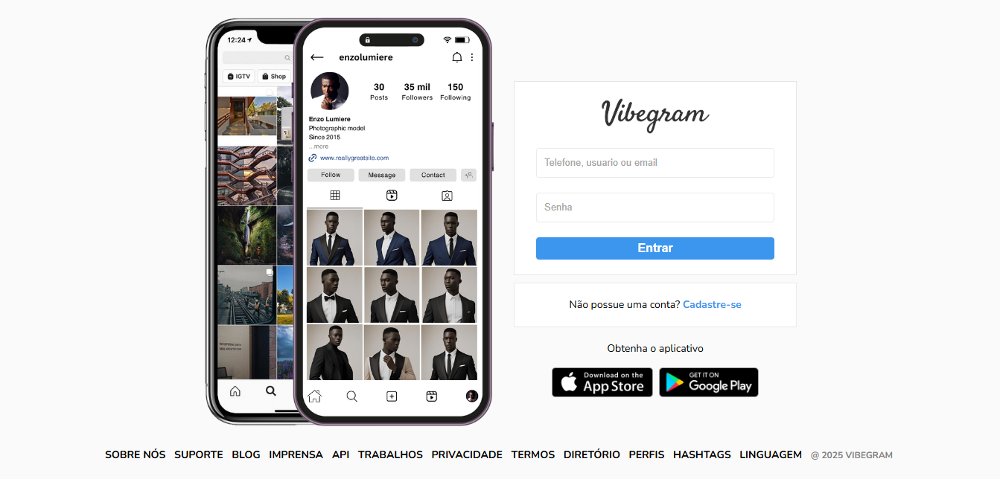

# 📱 Vibegram – Página de Login

Interface de login inspirada no Instagram, criada para fins educacionais com o objetivo de treinar habilidades em desenvolvimento de interfaces modernas e responsivas.

---

## 🔍 Descrição Geral

Este projeto faz parte da minha jornada de aprendizado em desenvolvimento web e simula a tela inicial de autenticação de um aplicativo fictício chamado **Vibegram**. 

---

## 🎯 Objetivo

O objetivo principal desta página é reproduzir de forma fiel e funcional uma interface de login inspirada em grandes plataformas, reforçando conceitos como layout, hierarquia visual, tipografia, espaçamento, responsividade e fidelidade visual.  
Além disso, ela poderá ser usada como base para aplicações maiores no futuro.

## 🖼️ Preview da Aplicação

### 📌 Página de Login  

---

## 🛠️ Tecnologias Utilizadas

- ⚙️ **HTML5** – Estrutura semântica da página  
- 🎨 **CSS3** – Estilização com foco em responsividade e fidelidade visual  
- 💻 **Design Responsivo** – Compatível com desktop e mobile  
- ☁️ **Hospedagem** – Vercel (ou Netlify)

---

## 📚 Finalidade

> Este projeto foi criado exclusivamente para fins de estudo e prática pessoal.

---

